<h3><code>tushar@github ~ $ ./contributions.sh</code></h3>

  

<h3><code>tushar@github ~ $ whoami</code></h3>
<table>
  <tr>
    <td valign="top"></td>
    <td valign="top"></td>
  </tr>
</table>

 

<h3><code>tushar@github ~ $ cat about.txt</code></h3>

  

<h3><code>tushar@github ~ $ ls ~/live --deployed</code></h3>

| app | what it is | open |
|:--|:--|:--|
| `webzoo-innovation` | Digital innovation hub & solutions platform | [open ↗](https://webzooinnovation.com) |
| `apex-signals` | Trading signals & market analysis | [open ↗](https://apex-signals.vercel.app) |
| `aura-design-studio` | Creative design portfolio | [open ↗](https://aura-design-studio-omega.vercel.app) |
| `rlm-prestige` | Premium real-estate showcase | [open ↗](https://rlm-prestigerealestate.vercel.app) |
| `fitness-regime` | Fitness tracking & workout app | [open ↗](https://fitness-regime.vercel.app) |
| `our-choice` | Community-driven choice platform | [open ↗](https://ourchoice-one.vercel.app) |
| `style-hub` | Fashion & design style collection | [v1 ↗](https://remix-of-remix-of-skardi-style-hub.vercel.app) · [v2 ↗](https://remix-of-remix-of-skardi-style-hub-psi.vercel.app) |
| `salvage-solutions` | Project showcase | [open ↗](https://salvage-solution-showcase.vercel.app) |
| `skardi-remix` | Design experimentation | [open ↗](https://remix-of-remix-of-remix-of-skardi-s.vercel.app) |

 

<h3><code>tushar@github ~ $ ls ~/repos --featured</code></h3>

<table>
  <tr>
    <td valign="top" width="50%">
      <a href="https://github.com/TUSHARXP-10/THE-REDMACHINE-2.O"><code>THE-RED-MACHINE-2.0</code></a> 
      Institutional-style trading system: automated retraining pipelines, real-time data, backtesting engine, live trading integration. 
      <code>python</code> <code>trading</code> <code>ml</code>
    </td>
    <td valign="top" width="50%">
      <a href="https://github.com/TUSHARXP-10/OTT-PORTFOLIO"><code>OTT-PORTFOLIO</code></a> 
      Netflix-style portfolio platform with an integrated CMS, dynamic animations and responsive design. 
      <code>react</code> <code>cms</code> <code>animation</code>
    </td>
  </tr>
</table>

 

<h3><code>tushar@github ~ $ ./links.sh</code></h3>

<a href="https://webzooinnovation.com"><code>portfolio</code></a> ·
<a href="https://linkedin.com/in/tushar-chandane"><code>linkedin</code></a> ·
<a href="mailto:tusharchandane8@gmail.com"><code>email</code></a> ·
<a href="https://github.com/TUSHARXP-10?tab=repositories"><code>all repos</code></a>

  

<code>open to collaborations, consulting and ambitious projects — founders & devs, say hi.</code>

