<!-- Generated by scripts/make_readme.py from profile.json — edit that file, not this one. -->

<a href="https://webzooinnovation.com"><picture><source media="(min-width: 701px)" srcset="https://raw.githubusercontent.com/TUSHARXP-10/TUSHARXP-10/main/assets/desktop/hero.svg"><source media="(max-width: 700px)" srcset="https://raw.githubusercontent.com/TUSHARXP-10/TUSHARXP-10/main/assets/mobile/hero.svg"></picture></a>
  
<a href="mailto:tusharchandane8@gmail.com"><picture><source media="(min-width: 701px)" srcset="https://raw.githubusercontent.com/TUSHARXP-10/TUSHARXP-10/main/assets/desktop/tldr.svg"><source media="(max-width: 700px)" srcset="https://raw.githubusercontent.com/TUSHARXP-10/TUSHARXP-10/main/assets/mobile/tldr.svg"></picture></a>
  
<a href="https://github.com/TUSHARXP-10"><picture><source media="(min-width: 701px)" srcset="https://raw.githubusercontent.com/TUSHARXP-10/TUSHARXP-10/main/assets/desktop/skyline.svg"><source media="(max-width: 700px)" srcset="https://raw.githubusercontent.com/TUSHARXP-10/TUSHARXP-10/main/assets/mobile/skyline.svg"></picture></a>
  
<a href="https://webzooinnovation.com"><picture><source media="(min-width: 701px)" srcset="https://raw.githubusercontent.com/TUSHARXP-10/TUSHARXP-10/main/assets/desktop/whoami.svg"><source media="(max-width: 700px)" srcset="https://raw.githubusercontent.com/TUSHARXP-10/TUSHARXP-10/main/assets/mobile/whoami.svg"></picture></a>
  
<a href="https://github.com/TUSHARXP-10/THE-REDMACHINE-2.O"><picture><source media="(min-width: 701px)" srcset="https://raw.githubusercontent.com/TUSHARXP-10/TUSHARXP-10/main/assets/desktop/spotlight.svg"><source media="(max-width: 700px)" srcset="https://raw.githubusercontent.com/TUSHARXP-10/TUSHARXP-10/main/assets/mobile/spotlight.svg"></picture></a>
  
<a href="https://github.com/TUSHARXP-10?tab=repositories"><picture><source media="(min-width: 701px)" srcset="https://raw.githubusercontent.com/TUSHARXP-10/TUSHARXP-10/main/assets/desktop/stack.svg"><source media="(max-width: 700px)" srcset="https://raw.githubusercontent.com/TUSHARXP-10/TUSHARXP-10/main/assets/mobile/stack.svg"></picture></a>
  
<a href="https://github.com/TUSHARXP-10?tab=repositories"><picture><source media="(min-width: 701px)" srcset="https://raw.githubusercontent.com/TUSHARXP-10/TUSHARXP-10/main/assets/desktop/langs.svg"><source media="(max-width: 700px)" srcset="https://raw.githubusercontent.com/TUSHARXP-10/TUSHARXP-10/main/assets/mobile/langs.svg"></picture></a>
  
<a href="https://github.com/TUSHARXP-10"><picture><source media="(min-width: 701px)" srcset="https://raw.githubusercontent.com/TUSHARXP-10/TUSHARXP-10/main/assets/desktop/activity.svg"><source media="(max-width: 700px)" srcset="https://raw.githubusercontent.com/TUSHARXP-10/TUSHARXP-10/main/assets/mobile/activity.svg"></picture></a>
  
<a href="https://webzooinnovation.com"><picture><source media="(min-width: 701px)" srcset="https://raw.githubusercontent.com/TUSHARXP-10/TUSHARXP-10/main/assets/desktop/head-live.svg"><source media="(max-width: 700px)" srcset="https://raw.githubusercontent.com/TUSHARXP-10/TUSHARXP-10/main/assets/mobile/head-live.svg"></picture></a>
<a href="https://webzooinnovation.com"><picture><source media="(min-width: 701px)" srcset="https://raw.githubusercontent.com/TUSHARXP-10/TUSHARXP-10/main/assets/desktop/items/project-webzoo-innovation.svg"><source media="(max-width: 700px)" srcset="https://raw.githubusercontent.com/TUSHARXP-10/TUSHARXP-10/main/assets/mobile/items/project-webzoo-innovation.svg"></picture></a>
<a href="https://apex-signals.vercel.app"><picture><source media="(min-width: 701px)" srcset="https://raw.githubusercontent.com/TUSHARXP-10/TUSHARXP-10/main/assets/desktop/items/project-apex-signals.svg"><source media="(max-width: 700px)" srcset="https://raw.githubusercontent.com/TUSHARXP-10/TUSHARXP-10/main/assets/mobile/items/project-apex-signals.svg"></picture></a>
<a href="https://aura-design-studio-omega.vercel.app"><picture><source media="(min-width: 701px)" srcset="https://raw.githubusercontent.com/TUSHARXP-10/TUSHARXP-10/main/assets/desktop/items/project-aura-design-studio.svg"><source media="(max-width: 700px)" srcset="https://raw.githubusercontent.com/TUSHARXP-10/TUSHARXP-10/main/assets/mobile/items/project-aura-design-studio.svg"></picture></a>
<a href="https://rlm-prestigerealestate.vercel.app"><picture><source media="(min-width: 701px)" srcset="https://raw.githubusercontent.com/TUSHARXP-10/TUSHARXP-10/main/assets/desktop/items/project-rlm-prestige.svg"><source media="(max-width: 700px)" srcset="https://raw.githubusercontent.com/TUSHARXP-10/TUSHARXP-10/main/assets/mobile/items/project-rlm-prestige.svg"></picture></a>
<a href="https://fitness-regime.vercel.app"><picture><source media="(min-width: 701px)" srcset="https://raw.githubusercontent.com/TUSHARXP-10/TUSHARXP-10/main/assets/desktop/items/project-fitness-regime.svg"><source media="(max-width: 700px)" srcset="https://raw.githubusercontent.com/TUSHARXP-10/TUSHARXP-10/main/assets/mobile/items/project-fitness-regime.svg"></picture></a>
<a href="https://ourchoice-one.vercel.app"><picture><source media="(min-width: 701px)" srcset="https://raw.githubusercontent.com/TUSHARXP-10/TUSHARXP-10/main/assets/desktop/items/project-our-choice.svg"><source media="(max-width: 700px)" srcset="https://raw.githubusercontent.com/TUSHARXP-10/TUSHARXP-10/main/assets/mobile/items/project-our-choice.svg"></picture></a>
<a href="https://remix-of-remix-of-skardi-style-hub.vercel.app"><picture><source media="(min-width: 701px)" srcset="https://raw.githubusercontent.com/TUSHARXP-10/TUSHARXP-10/main/assets/desktop/items/project-style-hub.svg"><source media="(max-width: 700px)" srcset="https://raw.githubusercontent.com/TUSHARXP-10/TUSHARXP-10/main/assets/mobile/items/project-style-hub.svg"></picture></a>
<a href="https://remix-of-remix-of-skardi-style-hub-psi.vercel.app"><picture><source media="(min-width: 701px)" srcset="https://raw.githubusercontent.com/TUSHARXP-10/TUSHARXP-10/main/assets/desktop/items/project-style-hub-v2.svg"><source media="(max-width: 700px)" srcset="https://raw.githubusercontent.com/TUSHARXP-10/TUSHARXP-10/main/assets/mobile/items/project-style-hub-v2.svg"></picture></a>
<a href="https://salvage-solution-showcase.vercel.app"><picture><source media="(min-width: 701px)" srcset="https://raw.githubusercontent.com/TUSHARXP-10/TUSHARXP-10/main/assets/desktop/items/project-salvage-solutions.svg"><source media="(max-width: 700px)" srcset="https://raw.githubusercontent.com/TUSHARXP-10/TUSHARXP-10/main/assets/mobile/items/project-salvage-solutions.svg"></picture></a>
<a href="https://remix-of-remix-of-remix-of-skardi-s.vercel.app"><picture><source media="(min-width: 701px)" srcset="https://raw.githubusercontent.com/TUSHARXP-10/TUSHARXP-10/main/assets/desktop/items/project-skardi-remix.svg"><source media="(max-width: 700px)" srcset="https://raw.githubusercontent.com/TUSHARXP-10/TUSHARXP-10/main/assets/mobile/items/project-skardi-remix.svg"></picture></a>
  
<a href="https://github.com/TUSHARXP-10?tab=repositories"><picture><source media="(min-width: 701px)" srcset="https://raw.githubusercontent.com/TUSHARXP-10/TUSHARXP-10/main/assets/desktop/head-repos.svg"><source media="(max-width: 700px)" srcset="https://raw.githubusercontent.com/TUSHARXP-10/TUSHARXP-10/main/assets/mobile/head-repos.svg"></picture></a>
<a href="https://github.com/TUSHARXP-10/THE-REDMACHINE-2.O"><picture><source media="(min-width: 701px)" srcset="https://raw.githubusercontent.com/TUSHARXP-10/TUSHARXP-10/main/assets/desktop/items/repo-the-redmachine-2-o.svg"><source media="(max-width: 700px)" srcset="https://raw.githubusercontent.com/TUSHARXP-10/TUSHARXP-10/main/assets/mobile/items/repo-the-redmachine-2-o.svg"></picture></a>
<a href="https://github.com/TUSHARXP-10/OTT-PORTFOLIO"><picture><source media="(min-width: 701px)" srcset="https://raw.githubusercontent.com/TUSHARXP-10/TUSHARXP-10/main/assets/desktop/items/repo-ott-portfolio.svg"><source media="(max-width: 700px)" srcset="https://raw.githubusercontent.com/TUSHARXP-10/TUSHARXP-10/main/assets/mobile/items/repo-ott-portfolio.svg"></picture></a>
  
<a href="mailto:tusharchandane8@gmail.com"><picture><source media="(min-width: 701px)" srcset="https://raw.githubusercontent.com/TUSHARXP-10/TUSHARXP-10/main/assets/desktop/head-links.svg"><source media="(max-width: 700px)" srcset="https://raw.githubusercontent.com/TUSHARXP-10/TUSHARXP-10/main/assets/mobile/head-links.svg"></picture></a>
<a href="https://webzooinnovation.com"><picture><source media="(min-width: 701px)" srcset="https://raw.githubusercontent.com/TUSHARXP-10/TUSHARXP-10/main/assets/desktop/items/link-portfolio.svg"><source media="(max-width: 700px)" srcset="https://raw.githubusercontent.com/TUSHARXP-10/TUSHARXP-10/main/assets/mobile/items/link-portfolio.svg"></picture></a>
<a href="https://linkedin.com/in/tushar-chandane"><picture><source media="(min-width: 701px)" srcset="https://raw.githubusercontent.com/TUSHARXP-10/TUSHARXP-10/main/assets/desktop/items/link-linkedin.svg"><source media="(max-width: 700px)" srcset="https://raw.githubusercontent.com/TUSHARXP-10/TUSHARXP-10/main/assets/mobile/items/link-linkedin.svg"></picture></a>
<a href="mailto:tusharchandane8@gmail.com"><picture><source media="(min-width: 701px)" srcset="https://raw.githubusercontent.com/TUSHARXP-10/TUSHARXP-10/main/assets/desktop/items/link-email.svg"><source media="(max-width: 700px)" srcset="https://raw.githubusercontent.com/TUSHARXP-10/TUSHARXP-10/main/assets/mobile/items/link-email.svg"></picture></a>
<a href="https://github.com/TUSHARXP-10?tab=repositories"><picture><source media="(min-width: 701px)" srcset="https://raw.githubusercontent.com/TUSHARXP-10/TUSHARXP-10/main/assets/desktop/items/link-github.svg"><source media="(max-width: 700px)" srcset="https://raw.githubusercontent.com/TUSHARXP-10/TUSHARXP-10/main/assets/mobile/items/link-github.svg"></picture></a>
  
<a href="mailto:tusharchandane8@gmail.com"><picture><source media="(min-width: 701px)" srcset="https://raw.githubusercontent.com/TUSHARXP-10/TUSHARXP-10/main/assets/desktop/footer.svg"><source media="(max-width: 700px)" srcset="https://raw.githubusercontent.com/TUSHARXP-10/TUSHARXP-10/main/assets/mobile/footer.svg"></picture></a>

 

<a href="mailto:tusharchandane8@gmail.com">tusharchandane8@gmail.com</a> · <a href="https://webzooinnovation.com">webzooinnovation.com</a> · <a href="https://linkedin.com/in/tushar-chandane">linkedin</a>
 
every panel above is an SVG generated by <a href="./scripts">./scripts</a> and refreshed daily by GitHub Actions

