  

<h3><code>tushar@github ~ $ ./contributions.sh</code></h3>

  

<h3><code>tushar@github ~ $ whoami</code></h3>

  

<h3><code>tushar@github ~ $ ./the-red-machine --architecture</code></h3>

  

<h3><code>tushar@github ~ $ tree ~/stack</code></h3>

  

<h3><code>tushar@github ~ $ ls ~/live --deployed</code></h3>

  

<h3><code>tushar@github ~ $ ls ~/repos --featured</code></h3>

  

<h3><code>tushar@github ~ $ ./links.sh</code></h3>

  

every card above is generated by <a href="./scripts">./scripts</a> and refreshed daily by GitHub Actions

